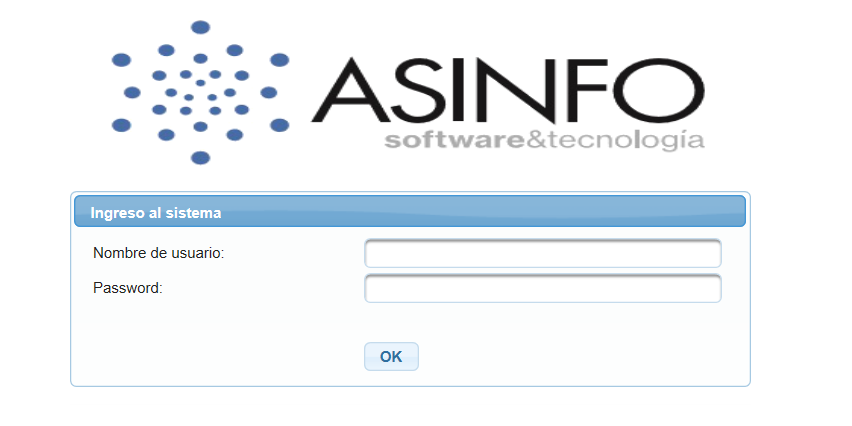

# Inicial

Se ingresa al Sistema a través de cualquier navegador web por ejemplo: Internet Explorer, Safari, Google Chrome, Mozilla \(recomendado\), etc.

En la barra de la dirección del navegador ingresar el URL de acceso al Sistema provisto por el Departamento Técnico de ASINFO.

```text
www.asinfo-cloud.com
```

Se ingresa el nombre de usuario y contraseña que previamente ha sido definido por el Administrador del Sistema a través del perfil. Ver Menú Seguridad.



